# Player Input

The **Player Input** class is responsible for processing hardware input from the player and passing the signals to the **Player Controller** to then trigger **events** bound to move the pawn, fire a weapon, or perform any other action.

In the past, the [`UPlayerInput`](https://docs.unrealengine.com/en-US/API/Runtime/Engine/GameFramework/UPlayerInput/){ target=_blank } class was used to handle player input, which could trigger special events for the **Input Actions** and **Input Axis** defined in the **Project Settings** (*Engine → Input*). This approach, however, is now deprecated in favor of the **Enhanced Input Plugin** which implements [`UEnhancedPlayerInput`](https://docs.unrealengine.com/en-US/API/Plugins/EnhancedInput/UEnhancedPlayerInput/){ target=_blank }. **Enhanced Input** offers a number of advantages over the legacy system, and implements features such as radial dead zones, contextual input, and prioritization, as well as the ability to remap the controls at runtime with ease.

Unreal Engine comes bundled with two more input plugins, which are also worth mentioning. The [**Raw Input Plugin**](https://docs.unrealengine.com/en-US/rawinput-plugin-in-unreal-engine/){ target=_blank } can be used to add support for specific devices that aren't properly handled by Microsoft's XInput API. Flight sticks and steering wheels fall into this category. There is also the [**Force Feedback Plugin**](https://docs.unrealengine.com/en-US/force-feedback-in-unreal-engine/){ target=_blank }, which would allow you to add **rumble** to gamepads and controllers.

## Enhanced Input Plugin

The plugin is enabled by default in the recent versions of Unreal Engine. Its associated classes should also be set as the default for **Player Input** and **Input Component** in the **Project Settings** (_Engine → Input_).

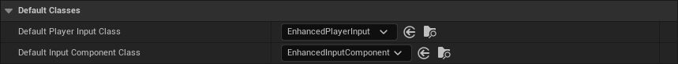{ .no-lightbox }

Now, if you right-click in the **Content Browser**, you should see the following options under **Input**:

<figure markdown>
    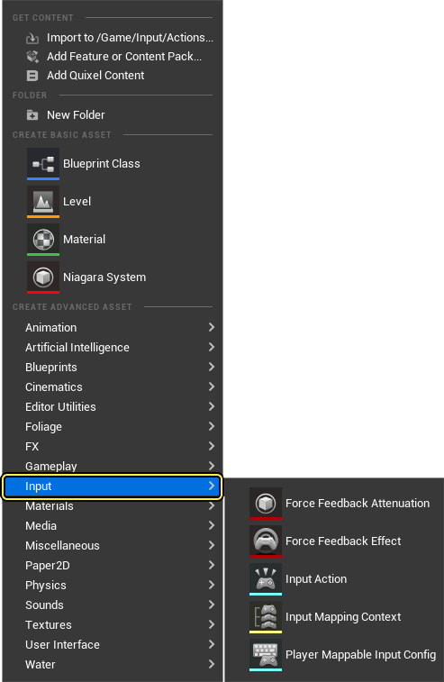
</figure>

Let us now take a look at the core elements of **Enhanced Input**.

### Input Actions

In **Enhanced Input**, every action that can be triggered by the player, such as moving in the world, looking around, firing a weapon, and jumping, should be represented via an **Input Action**, simple data assets with a handful of attributes.

<figure markdown>
    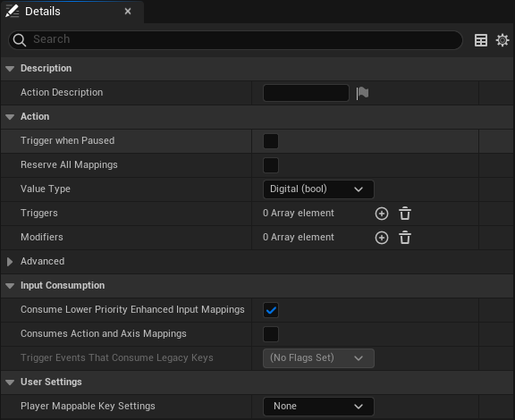
</figure>

The most important attribute of an **Input Action** is its **Value Type**, which can be:

-   **Digital**: Represented as a `Boolean`{.is-variable .boolean} value, and commonly used for actions that have an On/Off state. E.g., pressing a button to pick up item could be represented as a Digital action.
-   **Axis1D**: Represented as a `Float`{.is-variable .float} value, and commonly used for actions that have a range of values. An example would be using the middle mouse button to zoom in and out.
-   **Axis2D**: Represented as a `Vector2D`{.is-variable .vector} value. Axis2D can be helpful when representing actions such as moving or looking around.
-   **Axis3D**: Represented as a `Vector`{.is-variable .vector} value. Axis3D is less common, but it can be used to hold more complex data, such as motion controller information.

After deciding how you'd like to represent an action, you may want to use **Modifiers** and **Triggers** to your **Input Actions**, to further control how it processes user input and how the action reacts.

#### Modifiers

Modifiers are preprocessors that alter the raw input values that the engine receives before sending them out. They can be useful for applying sensitivity settings, smoothing input over multiple frames, or changing how input behaves based on the state of the player.

You can define your own **Modifiers** by inheriting from the [`UInputModifier`](https://docs.unrealengine.com/en-US/API/Plugins/EnhancedInput/UInputModifier/) class, and overriding the `ModifyRaw()` RPC, in either Blueprints or C++. Below is an example of a **Modifier** used in the **Lyra Game Sample**. 

```cpp
/* Applies an inversion of axis values based on a setting in the Lyra Shared game settings. */

UCLASS(NotBlueprintable, MinimalAPI, meta = (DisplayName = "Lyra Aim Inversion Setting"))
class ULyraInputModifierAimInversion : public UInputModifier {
	GENERATED_BODY()

public:
	
	// Custom parameters will show up in the Input Action editor.
	UPROPERTY(EditInstanceOnly, BlueprintReadWrite, Category=Settings, Config)
	bool bInvertVerticalAxis = false;

protected:

	virtual FInputActionValue ModifyRaw_Implementation(const UEnhancedPlayerInput* PlayerInput, FInputActionValue CurrentValue, float DeltaTime) override {
		{
			ULyraLocalPlayer* LocalPlayer = LyraInputModifiersHelpers::GetLocalPlayer(PlayerInput);
			if (!LocalPlayer) {
				return CurrentValue;
			}
			ULyraSettingsShared* Settings = LocalPlayer->GetSharedSettings();
			FVector NewValue = CurrentValue.Get<FVector>();
			if (bInvertVerticalAxis) {
				NewValue.Y *= -1.0f;
			}
			if (Settings->GetInvertHorizontalAxis()) {
				NewValue.X *= -1.0f;
			}
			return NewValue;
		}
	}
};
```

##### Bundled

The **Enhanced Input Plugin** comes bundled with a variety of **Modifiers** to perform common preprocessing tasks. The full list is shown below.

| Modifier                  | Description                                                                                                                                                                                                                                                                            |
|---------------------------|----------------------------------------------------------------------------------------------------------------------------------------------------------------------------------------------------------------------------------------------------------------------------------------|
| Deadzone                  | Input values within the range `LowerThreshold`{.is-variable .float} - `UpperThreshold`{.is-variable .float} will be remapped from 0-1. Values outside this range will be clamped.                                                                                                      |
| FOV Scaling               | Apply FOV dependent scaling to input values, per axis.                                                                                                                                                                                                                                 |
| Negate                    | Inverts input per axis.                                                                                                                                                                                                                                                                |
| Response Curve            | Apply a user-defined response curve to input values, per axis.                                                                                                                                                                                                                         |
| Scalar                    | Scales input by specified factor.                                                                                                                                                                                                                                                      |
| Scale By Delta Time       | Multiplies the input by `DeltaTime`{.is-variable .float}.                                                                                                                                                                                                                              |
| Smooth                    | Smooths the input over multiple frame.                                                                                                                                                                                                                                                 |
| Swizzle Input Axis Values | Useful to, for example, map 1D input signal for the W key to a Axis2D movement action.                                                                                                                                                                                                 |
| To World Space            | Auto-converts axes within the **Input Action** value into world space allowing the result to be directly plugged into functions that take world space values.<br>E.g. for a 2D input axis up/down is mapped to world X (forward), whilst axis left/right is mapped to world Y (right). |

#### Triggers

**Triggers** determine whether user input (after it has passed through the specified **Modifiers**), should activate the corresponding **Input Action**. 

By default, any user activity on an input will trigger on every tick. However, **Triggers** allow you to analyze the input, enabling you to check for minimum actuation values and validating patterns like short taps, prolonged holds, or the typical "press" or "release" events.

To implement your own **Triggers**, you must inherit from the [`UInputTrigger`](https://docs.unrealengine.com/en-US/API/Plugins/EnhancedInput/UInputTrigger/) class. You then need to override the `UpdateState()` RPC, which must return an `ETriggerState`{.is-variable .enum} value. The choices are:

-   `None`: Conditions have not been met, and the **Input Action** should not be activated.
-   `Ongoing`: Conditions are *partially* met, and the **Trigger** is ongoing but is not yet *over the hill*.
-   `Triggered`: Conditions have been *fully* met, and the **Trigger** has entered its final state.

Another overridable method to consider is `GetTriggerType()`, returning an `ETriggerType`{.is-variable .enum}. This flag can be `Explicit`, `Implicit`, or `Blocker`. The trigger type only comes into play when multiple **Triggers** are assigned to the same **Input Action**. In such cases, the **Input Action** is triggered if:

-   At least one `Explicit`-type **Trigger** fires.
-   Every single `Implicit`-type **Trigger** fires.
-   No `Blocker`-type **Trigger** fires.

The following example shows a **Trigger** that fires once input has remained actuated (e.g., the button has remained pressed) for `HoldTimeThreshold`{.is-variable .float} seconds.

```cpp title="UInputTriggerHold.h"
UCLASS(NotBlueprintable, MinimalAPI, meta = (DisplayName = "Hold"))
class UInputTriggerHold final : public UInputTriggerTimedBase {
    GENERATED_BODY()

    bool bTriggered = false;

protected:

    virtual ETriggerState UpdateState_Implementation(const UEnhancedPlayerInput* PlayerInput, FInputActionValue ModifiedValue, float DeltaTime) override;

public:

    virtual ETriggerEventsSupported GetSupportedTriggerEvents() const override { return ETriggerEventsSupported::Ongoing; }

    // How long does the input have to be held to cause trigger?
    UPROPERTY(EditAnywhere, Config, BlueprintReadWrite, Category = "Trigger Settings", meta = (ClampMin = "0"))
    float HoldTimeThreshold = 1.0f;

    // Should this trigger fire only once, or fire every frame once the hold time threshold is met?
    UPROPERTY(EditAnywhere, Config, BlueprintReadWrite, Category = "Trigger Settings")
    bool bIsOneShot = false;

    virtual FString GetDebugState() const override { return HeldDuration ? FString::Printf(TEXT("Hold:%.2f/%.2f"), HeldDuration, HoldTimeThreshold) : FString(); }
};
"
```

```cpp title="UInputTriggerHold.cpp"
ETriggerState UInputTriggerHold::UpdateState_Implementation(const UEnhancedPlayerInput* PlayerInput, FInputActionValue ModifiedValue, float DeltaTime) {
    // Update HeldDuration and derive base state
    ETriggerState State = Super::UpdateState_Implementation(PlayerInput, ModifiedValue, DeltaTime);
    
    // Trigger when HeldDuration reaches the threshold
    bool bIsFirstTrigger = !bTriggered;
    bTriggered = HeldDuration >= HoldTimeThreshold;
    
    if (bTriggered) {
        return (bIsFirstTrigger || !bIsOneShot) ? ETriggerState::Triggered : ETriggerState::None;
    }
    return State;
} 
```

##### Bundled

The following are the **Triggers** that come with the **Enhanced Input Plugin** out of the box.

| Trigger          | Description                                                                                                                                                                                                                                                                                                                                                                                                 |
|------------------|-------------------------------------------------------------------------------------------------------------------------------------------------------------------------------------------------------------------------------------------------------------------------------------------------------------------------------------------------------------------------------------------------------------|
| Chorded Action   | Applies a **Chord** action that must be triggering for this trigger’s action to trigger.<br>E.g., in AC2, you are able to attack a guard by pressing the *X*, but this would only take place if you were already holding down *right bumper* to allow *high profile* actions. In **Enhanced Input**, you'll need to add this trigger to the *attack* action and set *high profile* as its **Chord Action**. |
| Combo            | All actions in the **Combo Actions** array must be triggered to trigger the action this trigger is on. Actions must also be completed in the order specified by the combo actions array. This will only trigger for one frame before resetting the combo trigger’s progress.<br>Think of a *double jump* action that is triggered by pressing the *space bar* twice, or the combos in Street Fighter 6.     |
| Down             | Trigger fires when the input exceeds the Actuation Threshold.<br>When there are no triggers bound, this is the **default behavior** (Threshold=0).                                                                                                                                                                                                                                                          |
| Hold             | Trigger fires once input has remained actuated for Hold Time Threshold seconds.<br>Trigger may optionally fire once, or repeatedly fire.                                                                                                                                                                                                                                                                    |
| Hold And Release | Trigger fires when input is released after having been actuated for at least Hold Time Threshold seconds.                                                                                                                                                                                                                                                                                                   |
| Pressed          | Trigger fires once only when input exceeds the actuation threshold. Holding the input will not cause further triggers.                                                                                                                                                                                                                                                                                      |
| Pulse            | Trigger that fires at an Interval, in seconds, while input is actuated.                                                                                                                                                                                                                                                                                                                                     |
| Released         | Trigger returns Ongoing whilst input exceeds the actuation threshold, and then fires **once** only when input drops back below the actuation threshold.                                                                                                                                                                                                                                                     |
| Tap              | Input must be actuated and then released within Tap Release Time Threshold seconds to trigger.                                                                                                                                                                                                                                                                                                              |

### Mapping Contexts

**Mapping Contexts** bind hardware events to **Input Actions**. For example, you can associate **WASD** keys and the **Gamepad Left Thumbstick** movements with an **Input Action** for moving. You can assign additional **Modifiers** and **Triggers** to the **Input Actions**, as well. 

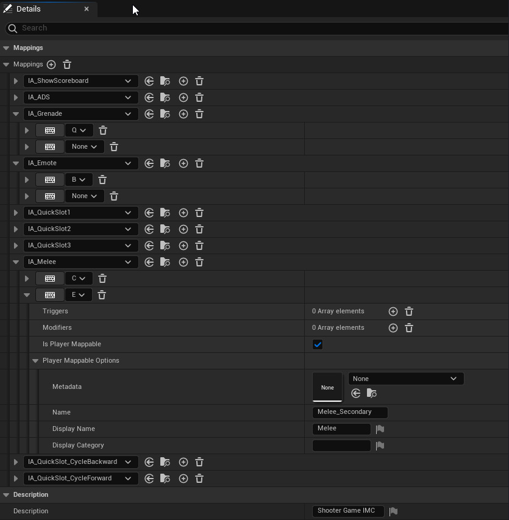

**Mapping Contexts** can be added and removed at runtime. This makes it easier to manage a large number of **Actions**. You can change how certain inputs behave depending on the current state of the player.

As an example, you can give a character who can swim, walk, and drive vehicles multiple **Input Mapping Contexts**; one for
common actions that are available and always mapped to the same user inputs, and another one for each individual mode 
of travel. Developers can then place the vehicle-related **Input Actions** into a separate **Input Mapping Context**, which is 
added to the local player when entering a vehicle, and removed from the local player when exiting the vehicle.

You can add a **Mapping Context** to your **Pawn** / **Character** to the player in either C++:

```cpp title="Class Member Definition"
UPROPERTY(EditAnywhere, Category="Input")
TSoftObjectPtr<UInputMappingContext> InputMapping;
```

```cpp title="BeginPlay()"
if (ULocalPlayer* LocalPlayer = Cast<ULocalPlayer>(Player)) {
    if (UEnhancedInputLocalPlayerSubsystem* InputSystem = LocalPlayer->GetSubsystem<UEnhancedInputLocalPlayerSubsystem>()) {
        if (!InputMapping.IsNull()) {
            InputSystem->AddMappingContext(InputMapping.LoadSynchronous(), Priority);
        }
    }
}
```

or Blueprints:

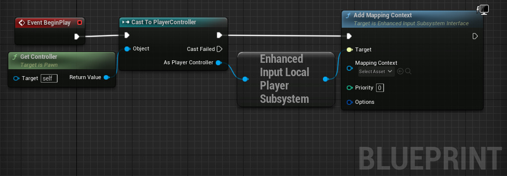

You can use `RemoveMappingContext()` or `ClearAllMappings()` to remove contexts dynamically.

### Input Listeners

After adding a **Mapping Context** to your **Pawn** / **Character**, you should be able to bind a callback function to each **Input Action** in C++:

```cpp
// You should override SetupPlayerInputComponent() to set up input bindings.
void AMyCharacter::SetupPlayerInputComponent(UInputComponent* PlayerInputComponent) {
    UEnhancedInputComponent* Input = Cast<UEnhancedInputComponent>(PlayerInputComponent);
    // You can bind to any of the trigger events here by changing the "ETriggerEvent" enum value
    Input->BindAction(AimingInputAction, ETriggerEvent::Triggered, this, &AFooBar::SomeCallbackFunc);
}

void AMyCharacter::SomeCallbackFunc(const FInputActionInstance& Instance) {
    // Get the value of the Input Action for whatever type you want here...
    FVector VectorValue = Instance.GetValue().Get<FVector>();
    FVector2D 2DAxisValue = Instance.GetValue().Get<FVector2D>();
    float FloatValue = Instance.GetValue().Get<float>(); 
    bool BoolValue = Instance.GetValue().Get<bool>();
    // Do your cool stuff here!
} 
```

or in Blueprints, by simply looking up the name of the **Input Action**:

<figure markdown>
    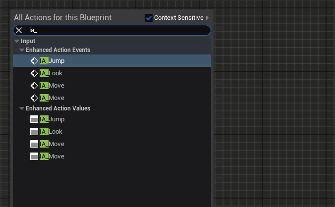
</figure>

These **Input Listeners** will maintain an internal **Trigger Event** flag of type `ETriggerEvent`{.is-variable .enum}. This flag will be updated whenever a **Trigger** associated with the **Input Action** changes its state. Depending on the old (red) and the new (arrow) value of the **Trigger State**, the following events (blue) will be fired:

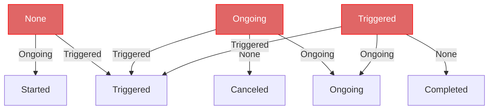

In C++, `FInputActionInstance.GetTriggerEvent()` in the callback function will return the current value of the 
**Trigger Event** flag.

### Platform Setting

You may want different input settings for different platforms, such as rotating the face buttons on the Nintendo Switch or altering the actions available on mobile devices. **Enhanced Input** provides a per-platform **Mapping Context Redirect** that allows you to do this easily. Any time the mapping context is referenced on a specific platform, it will be replaced by the value in the map when the mappings are rebuilt.

In order to define your **Mapping Context Redirects**, you need to create a Blueprint, with `EnhancedInputPlatformData` as the parent class, for every platform. You can then specify which **Mapping Context** should be mapped to another on the corresponding platform.

<figure>
    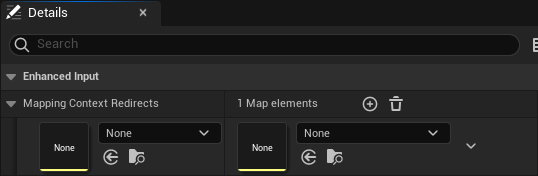
</figure>

After creating the blueprints, you need to head to _Project Settings → Engine → Enhanced Input → Platform Settings_ to then set the associated **Redirect** for each platform.

<figure>
    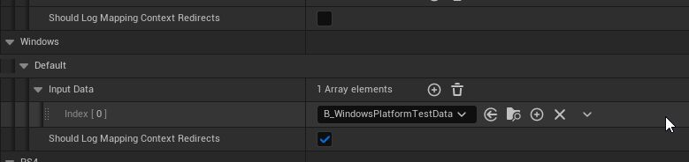
</figure>

### Debugging

**Enhanced Input** offers a few commands to help you debug your input mappings. 

By entering `showdebug enhancedinput` in the console, Unreal Engine will show you the state of every relevant **Input Action** and their associated hardware inputs, allowing to debug your bindings:

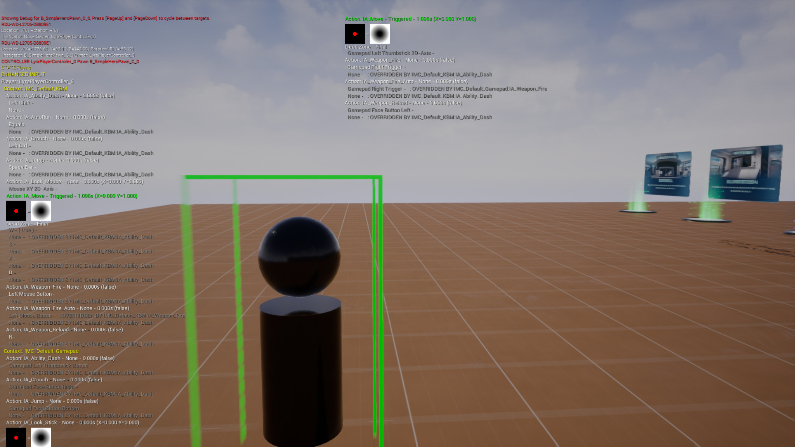

You also have the option of debugging your connected input devices by using `showdebug devices`:

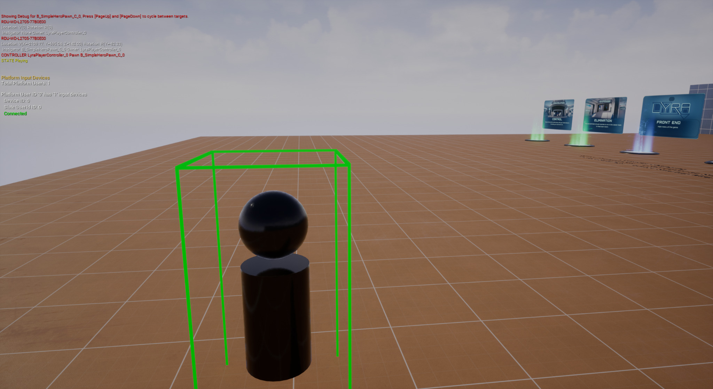

#### Injecting Input

Enhanced Input also brings along the concept of **Injecting Input** to your player. This option allows you to simulate hardware input. You must use the `Input.+key` command to start simulating input and `Input.-key` to stop it.

Below is an example of setting the `Gamepad_Left2D` key:

```shell
Input.+key Gamepad_Left2D X=0.7 Y=0.5
Input.-key Gamepad_Left2D
```

You can find the names of hardware inputs in [`InputCoreTypes.cpp`](https://github.com/EpicGames/UnrealEngine/blob/release/Engine/Source/Runtime/InputCore/Private/InputCoreTypes.cpp){ target=_blank }.

You also have the option of injecting input to the player in C++:

```cpp
UEnhancedInputLocalPlayerSubsystem* Subsystem = ULocalPlayer::GetSubsystem<UEnhancedInputLocalPlayerSubsystem>(PC->GetLocalPlayer());
UEnhancedPlayerInput* PlayerInput = Subsystem->GetPlayerInput();
FInputActionValue ActionValue(1.0f); // This can be a bool, float, FVector2D, or FVector
PlayerInput->InjectInputForAction(InputAction, ActionValue); 
```

and Blueprints:

<figure>
    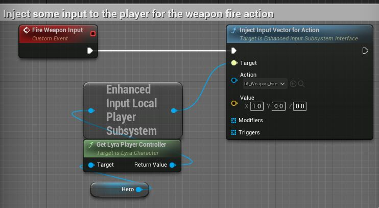
</figure>
