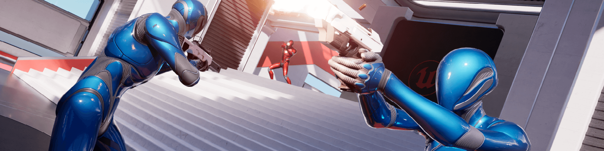

# Unreal Engine 5 Tutorials

{.hero}

Here you can find a curated set of tutorials for Unreal Engine 5, adhering to best practices and using the latest 
features. Tutorials may link related pieces of documentation for further reading. 

You can use the search bar at the top to look for a certain topic or mechanism you'd like to learn more about, or 
navigate through the tutorials using the left sidebar.
